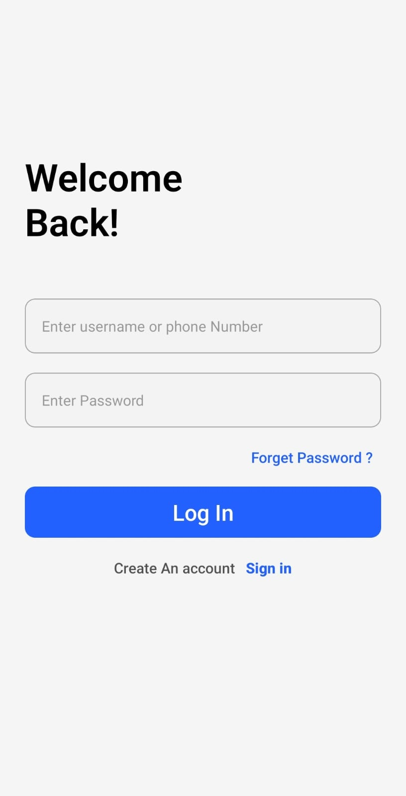
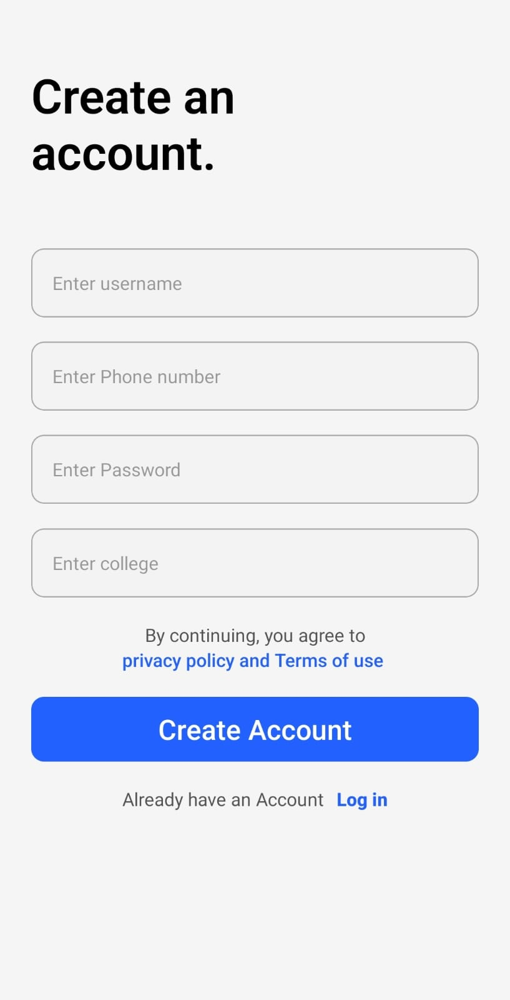
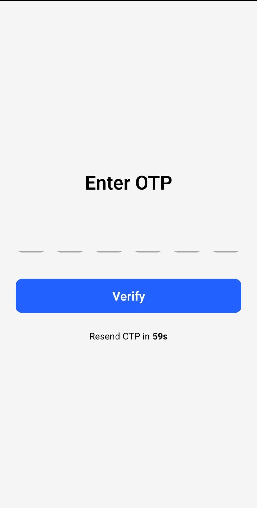
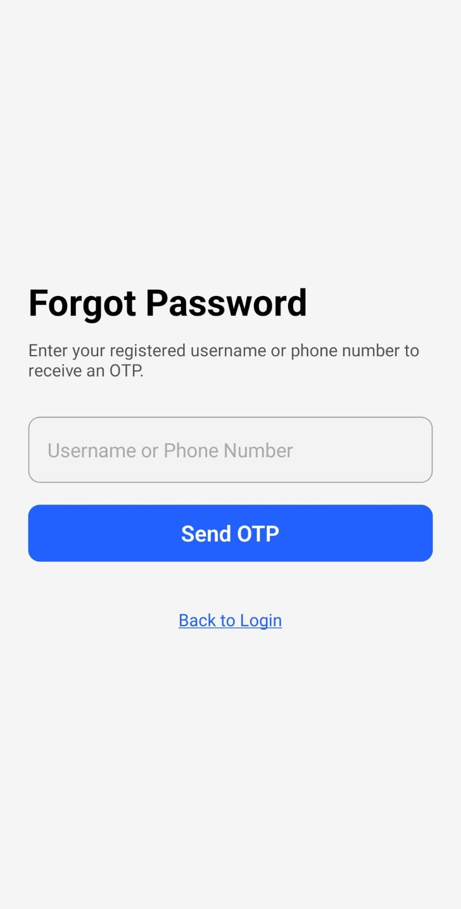
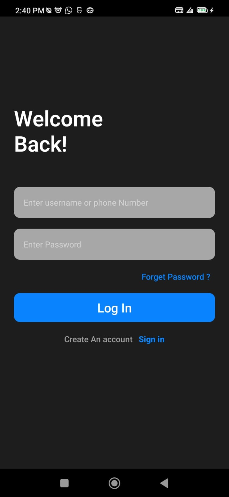
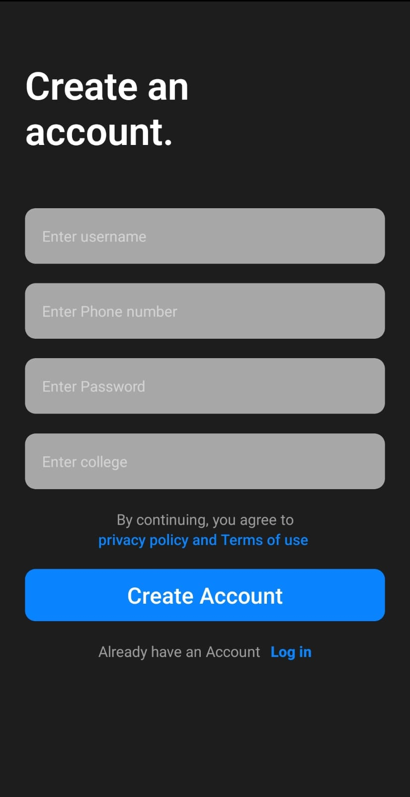
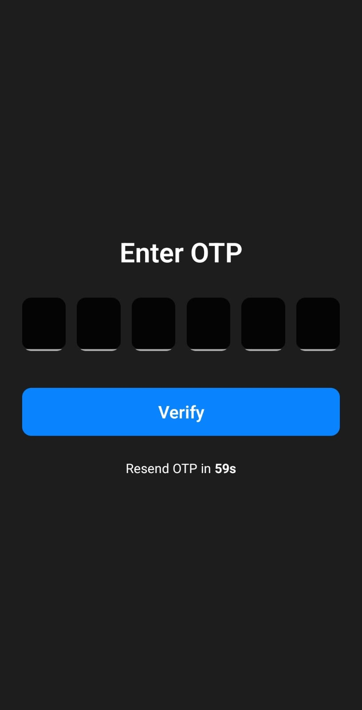
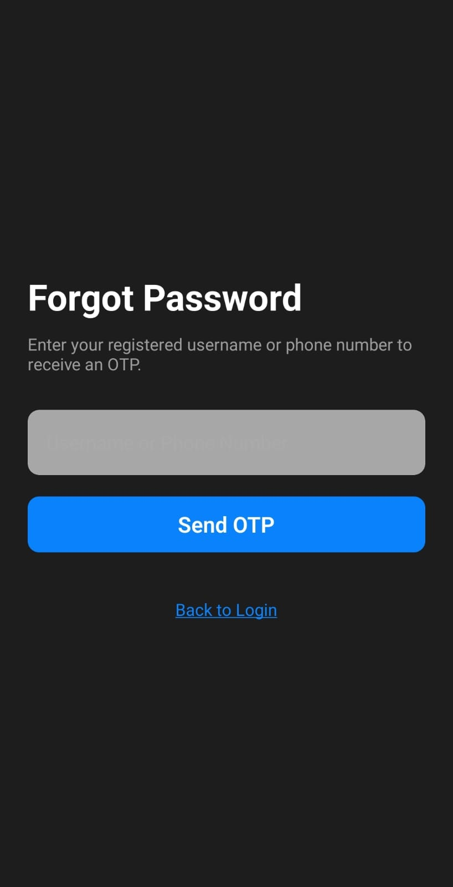
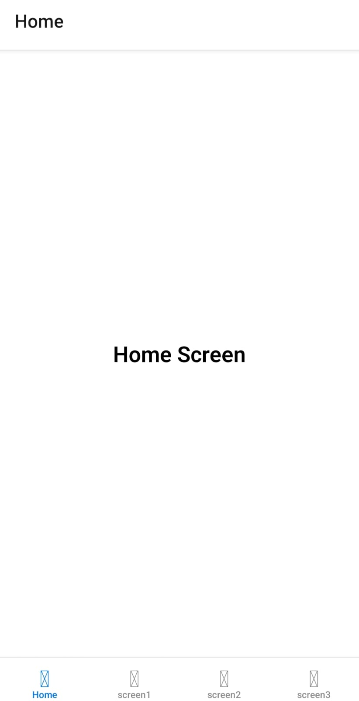
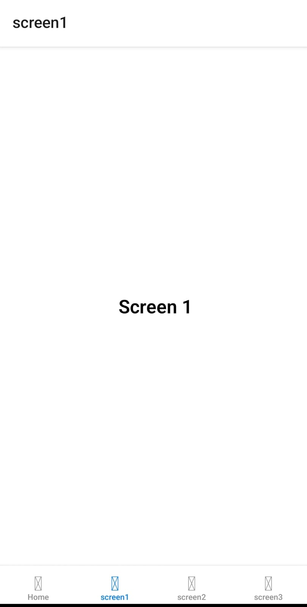

# 🚀 React Native CLI Template

This is a production-ready **React Native CLI** boilerplate for rapid mobile app development. It includes built-in **authentication flow**, **Zustand** for state management, and **React Navigation** for routing.


# template preview
<h3>🌞 Light Theme Preview</h3>

<p align="center">
  
  
  
  
  
</p>

## dark theme
<h3>🌑 dark Theme Preview</h3>

<p align="center">
  
  
  
  
  
</p>


## pages 
<h3>Screen</h3>

<p align="center">
  
  
</p>


---

## 📦 Tech Stacks

- ⚛️ React Native CLI (with Android & iOS support)
- 🧭 React Navigation (v6+)
- 📦 Zustand (lightweight global state)
- 🔐 Complete Auth Flow (Login, Signup, OTP, Forgot Password)
- 📂 Modular & Scalable Folder Structure

---

## 📁 Folder Structure

***project-root/
│
├── android/ # Android native project
├── ios/ # iOS native project
├── src/
│ ├── navigation/ # Auth & Main stack navigation
│ ├── screens/ # Screens (Auth + Main)
│ ├── store/ # Zustand state management
│ ├── api/ # API services (Axios instance)
│ ├── constants/ # Theme, colors, dimensions
│ ├── components/ # Reusable components (buttons, cards, etc.)
│ └── utils/ # Debounce, formatters, helpers
│
├── App.js # App entry point
├── index.js # RN entry point
├── package.json
└── README.md
***


---

## ✨ Features

### 🔐 Authentication Flow

- Login
- Signup
- OTP Verification
- Forgot Password
- Zustand-powered token/session management

### 🧭 Navigation

- `AuthStack`: Login, Signup, OTP, Forgot Password
- `MainStack`: Home, Profile, etc.
- Navigation handled via `@react-navigation/native`

### ⚙️ Zustand State

- Auth store (token, user)
- Theme or dark mode support (optional)
- Easy-to-extend global state

---

## 🚀 Getting Started

### 1. Clone the Repo

```bash
git clone <your-repo-url>
cd RnApp__Temp2024/app


npm install
npx pod-install # iOS only

npx react-native run-android

npx react-native run-ios


